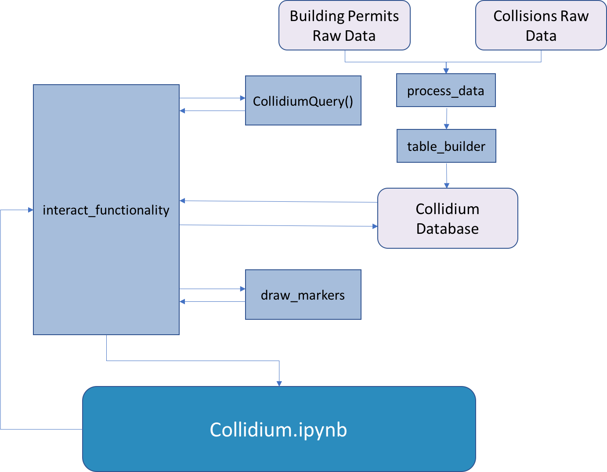

# Collidium

## Pre-dependencies
The user will interact with a jupyter notebook that displays greater Seattle maps with default construction and collision data visualized. In each of our use cases, jupyter interact widgets will allow the user to interact with our settings and update the map views. Maps will each have before, during, and after construction views of collision density at each new building site under the default (or selected) parameters.

The underlying database required to update our maps will be created in our 
python package, and the processed data will be condtained in a database called Collidium. This database includes fields for collision ID building pairs incluidng collision id, collision latitude and longitude, distance between collision and building site, distance between collision and construction site indicators for whether the collision happened before, during or after construction, number of days the collision occured from consturction window, collision type, building type, and collision severity. Much of the functionality of our project relies on querying this database.

## Components

The interactions between the components that make up the Collidium project are depicted in the flowchart below.

A full description of each of these components is provided below:

## process_data
- **Name:** process_data
- **What it does:** Cleans and processes the raw data files. Runs geopy to link building permit and collision observations based on the their distance (within 1500 ft) and occurrence (within one year of start or end of building permit)
- **Inputs** The inputs are the raw_building_input.csv file and the raw_collision_input.csv file which are downloaded directly from the Seattle Open Data portal
- **Outputs**: The output is three .csv files which include the collisions.csv, buildings.csv, and collidium_data.csv. 
- **How it interacts with other components:** The process_data module is the first module called when building the database. The collidium_data.csv output file is a direct input into the table_builder module.

## table_builder
- **Name:** table_builder
- **What it does:** It takes the processed collidium_data.csv file and creates the Collidium database, preserving the data types from each column. 
- **Inputs** The input is the collidium_data.csv file produced by the process_data module.
- **Outputs**: The Collidium.db database file containing the linked building permit and collision observations.
- **How it interacts with other components:** The table_builder module takes the collidium_data.csv output from the process_data module. The output file (Collidium.db) is called by the interact_functionality.py module to update the maps in the Collidium.ipynb notebook.

## query_class

- **Name:** CollidiumQuery
- **What it does:** It stores user widget inputs as class variables, and constructs a sqlite query string from those attributes. The query string is designed to interact with the collidium_data table on the Collidium sqlite database, in order to pull before, during, and after collision counts for all collisions meeting the CollidiumQuery's attribute parameters at each building.

- **Inputs:** Both the class constructor and individual `set_attribute` class methods take valid attribute input as arguments to set attributes. The only attribute without a set function is the query string, `qstring`. The following inputs/types/values are valid:

| Argument Name | Description                                                       | Default Value | Valid Types                      | Valid Values                                                                                  |
|---------------|-------------------------------------------------------------------|---------------|----------------------------------|-----------------------------------------------------------------------------------------------|
| b_category    | Building category                                                 | 'All'         | list or single element as string | ['All', 'COMMERCIAL', 'MULTIFAMILY', 'INDUSTRIAL', 'INSTITUTIONAL', 'SINGLE FAMILY / DUPLEX'] |
| radius        | Distance between building and collision site                      | 1500          | int                              | (0, 1500]                                                                                     |
| base_year     | Year of building completion date                                  | 2016          | int                              | [2014, 2017]                                                                                  |
| duration      | Months to count collisions before and after building construction | 12            | int                              | (0, 12]                                                                                       |
| c_severity    | Accident severity                                                 | 'All'         | list or single element as string | ['All', 'Fatality', 'Serious Injury', 'Injury', 'Property Damage Only']                       |
| c_type        | Accident Type                                                     |  'All'        | list or single element as string | ['All', 'Vehicle Only', 'Bike/Pedestrian']                                                    |

- **Outputs:**  Class method `get_qstring` constructs and returns a sqlite query string designed to pull before, during, and after collision counts meeting the class attribute value parameters from the collidium_data table on the sqlite Collidium database.

- **How it interacts with other components:** The `interactions_functionality.py` module creates a CollidiumQuery instance, and modifies the class attributes as the user makes interactive selections in the front-end Jupyter notebook. The `interactions_functionality.py` module requests the query string whenever it is needed to pull data results for a map update.

## draw_markers

- **Name:** draw_markers

- **What it does:** This component takes a data set and uses its information to draw three maps, and place markers on them. The maps shwo the city of Seattle and the markers represent the location of new building construction. The the size of the marker corresponds to the number of collisions that happened in the period before, during or after the construction period. 

- **Inputs:** This module takes as input a Pandas dataframe with the following fields:
  - Data: a dataframe that contains the following fields:
    - b_id (int): buiding id number (key)
    - b_lat (float): latitude of building
    - b_long (float): longitude of building
    - before (int): Number of collisions that happend in period prior to construction
    - during (int): Number of collisions that happend in period during construction
    - after (int): Number of collisions that happend in period after construction.
- 
- **Outputs:** Three map objects place side by side. Each of the three maps will show a map of the city of Seattle with points plotted to show the location of buildings constructed in the selected time period. The size of the point will indicate the number of collisions that occured near the building. The color of the points corresponds to whether the number of collisions represents an increase from the before construction period (red) or a decrease relative to the before construction period (green) or same as the preconstruction period (blue). The left most map will show the number of collisions prior to construction, the middle map will show the number of collisions during construction and the right most map will show the number of collisions that occured after construction.

- **How it interacts with other components:** This module interacts with many other modules as follows:
  + *interactions_functionality*: The draw\_markerss module is executed within the interactions\_functionality module. 
  + *Collidium.ipynb*: The maps that are generated by the draw_markers module are displayed in the Collidium.ipynb notebook. 

## interact_functionality:
- **Name:** interact_functionality
- **What it does:** This module sets up functions that enable the users to  select filtering criteria for which buildings and collisions should be displayed on a map. These functions are then executed using the ipywidgets interactive functionality within a jupyter notebook environement. This work is done by six functions that end in *\_interact in this module. These functions allow users to choose criteria to filter on, then write a query using the query\_class. The dataframe that results from the query is stored in a Pandas dataframe and then mapped using the draw_markers module. In addition to the *\_interact functions, this module includes three set up functions that aid in streamlining the interact functions. These fucntions have the following purpose: generate\_connection: generates a connection to an SQLite3 database, generate\_categories lists the filter options for various categories, and generate_table function transforms an SQLite3 database table into a pandas dataframe. 
- **Inputs:**
  -  data_directory: Path to data directory where Collidium database is located. Collidium database includes data for collision and building pairs within 1500 foot radius of construction site. Fields include by construction begin date, construction end date, collision date, base year (year of construction completeion), indicator for whether the collision happened before, during or after construction, number of days the collision occured from construction window, collision type, building type, and collision severity.
  -  query_class: The query class is used within this module to develop a query that extracts the data from the Collium database that is used to populate the maps
  -  draw_markers: The draw markers module is used within this module to draw the maps based on the data that is extracted from the Collidium database using the query class. The maps are displayed in the Jupyter notebook environment.
  -  User inputs: The *\_interact* functions each allow user to enter input to filter the data.   These options include: building_category (str), building_year (int), collision_interval (int) collision_severity (str), collision_type (str), and radius_from_building (int).

- **Outputs:** 
- The *\_interact functions each output three map objects with building permits plotted on it, with volume of collisions codified by size and change in volume of collisions relative to preconstruction period codified by color. The three maps correspond to collision count before construction, during construction and after construction. These are intended to be run in a jupyter notebook environment. 

- **How it interacts with other components:** This component uses database created in by the process_data and table_builder modules. Recieves query created in the "build\_query" component and uses it to query database. Builds maps using the draw_markers component and visualizes maps in the UI component 

## Collidium.ipynb
- **Name:** Collidium.ipynb
- **What it does:** This component is used as our user interface. It imports the modules outlined above and collects input from the user using ipywidgets interact functionality. Once the user has completed their interaction it runs the modules and creates map visualizations. 

- **Inputs:**  User inputs: Each use case allows users to select an option frm a drop down menu in the user interface. These include:  building_category (str), building_year (int), collision_interval (int) collision_severity (str), collision_type (str), and radius_from_building (int).

- **Outputs:** Three maps are visualized for each use case

- **How it interacts with other components:** Collidium.ipynb accesses the database created in by the process_data and table_builder modules. It runs the functions that were developed in the interactions_functionality functions, which runs the query created using the "build\_query" component to structure the data to run the draw_markers module.  

  

